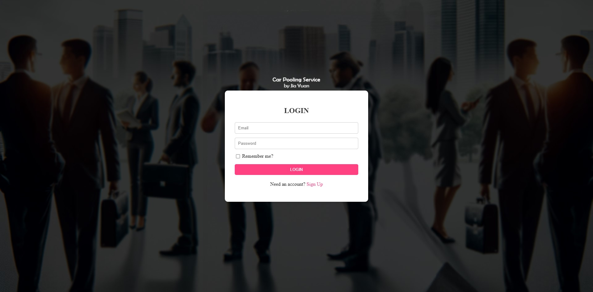
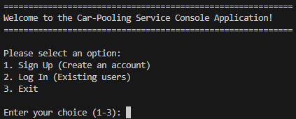

# Car-Pooling Service Platform

## Introduction
This project implements a car-pooling service platform using microservices architecture. The application facilitates users to either offer car-pooling services (as car owners) or enroll in available trips (as passengers). The backend is developed in Go, interfacing with a MySQL database, and the front-end is a web application using HTML, CSS, and JavaScript. 

## Design Considerations

### Microservices
- **User Service**: Handles user authentication, profile management, and user-type upgrades.
- **Trip Service**: Manages trip creation, enrollment, and trip history.
- **Technologies**: Go for backend services, MySQL for persistent storage.
- **Communication**: RESTful APIs for microservice interaction.

### Frontend
- **Web Application**: Developed using HTML, CSS, and JavaScript.
- **Interaction**: Communicates with backend microservices via AJAX calls.

## Architecture Diagram

*Placeholder for the architecture diagram showing the microservices structure and interactions.*

## Key Features

- **Password Hashing**: Implements bcrypt hashing for secure password storage, ensuring user credentials are protected.
- **Automated Trip Management**: The system automatically monitors trip schedules. Trips past their start time are automatically flagged and removed from active listings, ensuring data accuracy and relevancy.
- **User Type Flexibility**: Users can sign up as passengers and later upgrade to car owners.

## Screenshots

*Placeholder for a screenshot of the login page.*

*Placeholder for a screenshot of the main menu based on user type.*

## Setup and Running Instructions
1. **Backend Services**:
   - Navigate to each service directory (`user-service`, `trip-service`).
   - Run `go run main.go` to start each service.
2. **Frontend**:
   - Open the `index.html` from the `web-frontend` directory in a browser.
   - Ensure backend services are running for full functionality.

## Database Configuration
- Ensure MySQL is running and configured by creating the 2 database (`carpool` and `carpool_trips`)
- Backend services will auto create the table in the 2 database created.

---

By [Ong Jia Yuan]

# Car-Pooling Service Platform - Task List

1. User Account Creation
- Status: Completed
- Details: Implementation allows both passengers and car owners to create accounts.

2. Default Passenger Profile Creation
- Status: Completed
- Details: Users provide first name, last name, mobile number, and email address.

3. Car Owner Profile Enhancement
- Status: Completed
- Details: Passenger profiles can be upgraded to car owner profiles with additional details like driver’s license and car plate number.

4. Account Information Update
- Status: Completed
- Details: Users can update their account information.

5. Account Deletion Post One Year
- Status: Completed
- Details: Users can delete their accounts after 1 year, adhering to data retention policies.

6. Trip Publishing by Car Owners
- Status: Completed
- Details: Car owners can publish trips with detailed information including pick-up, alternative pick-up locations, start time, destination, and passenger capacity.

7. Trip Enrollment by Passengers
- Status: Completed
- Details: Passengers can browse, search, and enroll in available trips with seat availability and no schedule conflicts.

8. Trip Management by Car Owners
- Status: Completed
- Details: Car owners can only start 30 minutes in the future of scheduled time

10. Retrieve Past Trips
- Status: Completed
- Details: Users can access their past trips in reverse chronological order.

## Additional Features

1. Password Hashing
- Status: Completed
- Details: Passwords are securely hashed during account creation and login.

2. Automatic Trip Deletion
- Status: Completed
- Details: Past trips are automatically deleted from the system after their scheduled start time.

3. Cancel Enrollment (Front-end)
- Status: Completed
- Details: Passengers can cancel their enrollment trip but will not be able to enroll in the same trip.

4. User Authentication (Front-end)
- Status: Completed
- Details: User who tries to enter the main menu page manually in the URL will automatically redirect to login page.

This document will be updated as the project progresses, reflecting new implementations and enhancements.

